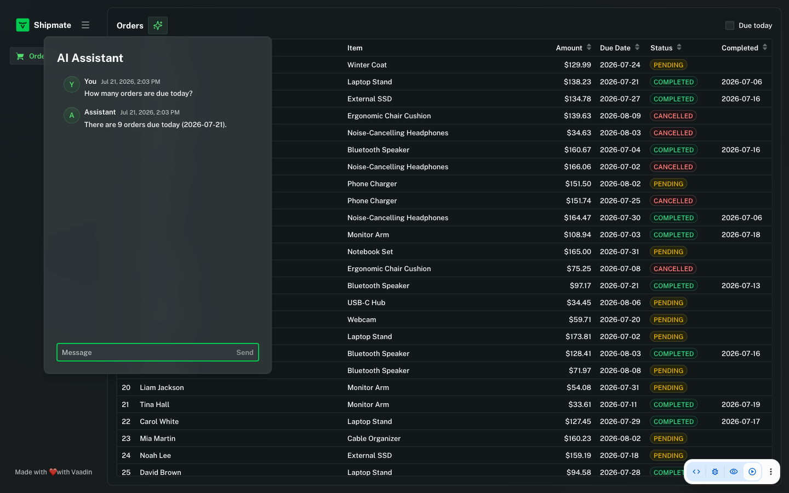
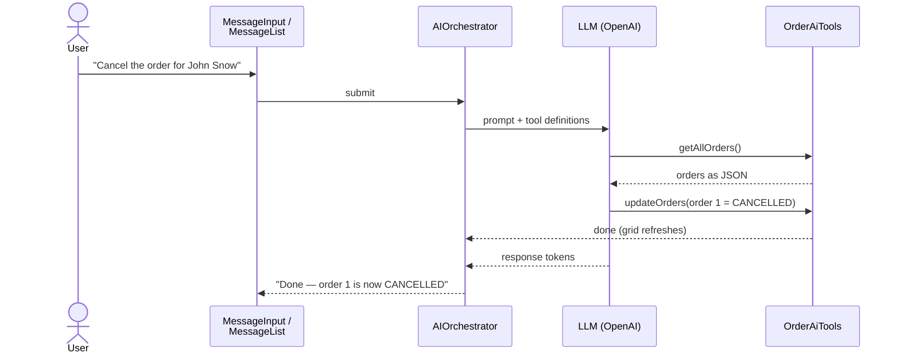
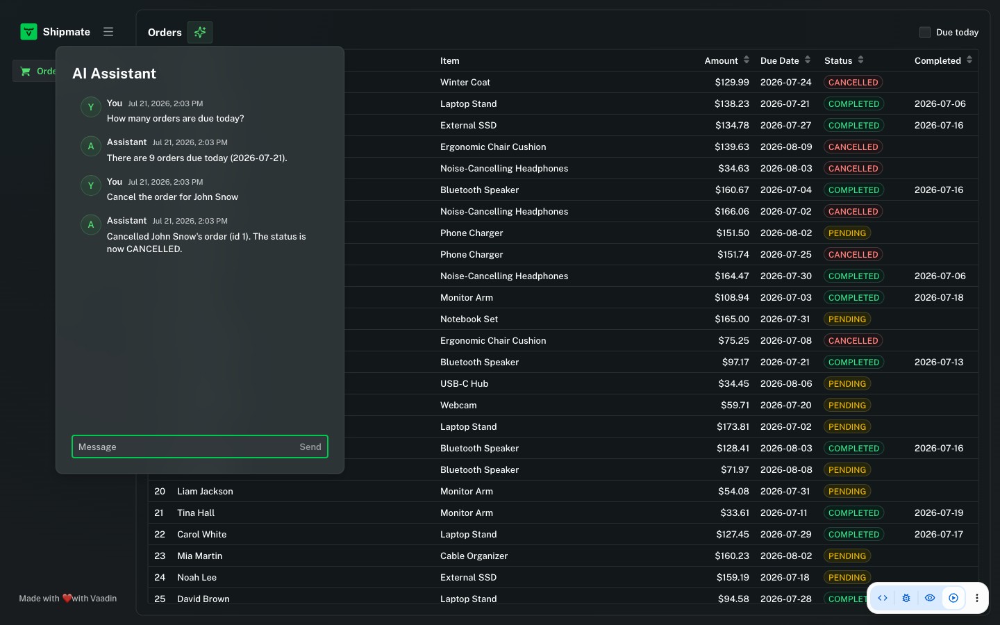

# Adding AI Chat to Your Java Web App

Add an AI assistant to a Vaadin + Spring Boot app that can answer questions about your data — and modify it — through natural-language chat. Built with the Vaadin AI components (`AIOrchestrator`, preview in Vaadin 25.2) and Spring AI.

The example app is an order-management view: a grid of 100 customer orders and an AI chat that can answer "How many orders are due today?" or execute "Cancel the order for John Snow."



## Prerequisites

- A Vaadin 25.2+ / Spring Boot project (e.g. from [start.vaadin.com](https://start.vaadin.com))
- Java 21+
- Server push enabled, so AI responses can stream token-by-token into the UI:

```java
@SpringBootApplication
@Push
public class Application implements AppShellConfigurator {
    // ...
}
```

- The AI components are a preview feature in Vaadin 25.2, so enable the feature flag in `src/main/resources/vaadin-featureflags.properties`:

```properties
com.vaadin.experimental.aiComponents=true
```

- Spring AI dependencies in `pom.xml` — the BOM plus a starter for your LLM provider (OpenAI here):

```xml
<dependencyManagement>
    <dependencies>
        <dependency>
            <groupId>org.springframework.ai</groupId>
            <artifactId>spring-ai-bom</artifactId>
            <version>2.0.0</version>
            <type>pom</type>
            <scope>import</scope>
        </dependency>
    </dependencies>
</dependencyManagement>

<dependencies>
    <dependency>
        <groupId>org.springframework.ai</groupId>
        <artifactId>spring-ai-starter-model-openai</artifactId>
    </dependency>
</dependencies>
```

## Step 1: Get an API Key for Your AI Provider

Spring AI supports all the major LLM providers — each has its own starter dependency, and the rest of your code stays the same:

| Provider | Starter artifact |
|---|---|
| OpenAI | `spring-ai-starter-model-openai` |
| Anthropic (Claude) | `spring-ai-starter-model-anthropic` |
| Azure OpenAI | `spring-ai-starter-model-azure-openai` |
| Google Gemini | `spring-ai-starter-model-google-genai` |
| Amazon Bedrock | `spring-ai-starter-model-bedrock-converse` |
| Ollama (local models) | `spring-ai-starter-model-ollama` |

For OpenAI, create a key at [platform.openai.com/api-keys](https://platform.openai.com/api-keys). Keep it out of your code and out of git — either export it as an environment variable, or put it in a separate properties file that git ignores (shown in the next step).

```bash
export OPENAI_API_KEY=sk-...
```

## Step 2: Configure application.properties

Point Spring AI at your key and pick a model:

```properties
# The API key lives in the git-ignored application-local.properties
# (or the OPENAI_API_KEY environment variable)
spring.config.import=optional:classpath:application-local.properties
spring.ai.openai.api-key=${OPENAI_API_KEY:}
spring.ai.openai.chat.model=gpt-5-mini
spring.ai.openai.chat.reasoning-effort=low
```

If you prefer the properties-file route, create `src/main/resources/application-local.properties` with the real key and add the file name to `.gitignore`:

```properties
spring.ai.openai.api-key=sk-...
```

> **Model choice matters.** The AI will be reasoning over raw data — counting, filtering, and comparing rows. Non-reasoning models (e.g. `gpt-4o-mini`, `gpt-4.1`) consistently miscounted a 100-row dataset in testing. A reasoning model like `gpt-5-mini` answered every question exactly right; `reasoning-effort=low` keeps responses fast while staying accurate.

With the starter on the classpath and a key configured, Spring Boot auto-configures a `ChatModel` bean you can inject anywhere.

## Step 3: Create AI Tools the LLM Can Call

Tools are plain Java methods the LLM is allowed to invoke during a conversation. Annotate them with Spring AI's `@Tool` and give each a short description — the LLM uses the method signatures and descriptions to decide when and how to call them.

Create `OrderAiTools`:

```java
public class OrderAiTools {

    private final OrderService orderService;
    private final Runnable onDataChanged;

    public OrderAiTools(OrderService orderService, Runnable onDataChanged) {
        this.orderService = orderService;
        this.onDataChanged = onDataChanged;
    }

    @Tool(description = "Returns all orders")
    public List<Order> getAllOrders() {
        return orderService.findAll();
    }

    @Tool(description = "Updates orders in database")
    public void updateOrders(List<Order> orders) {
        orderService.save(orders);
        onDataChanged.run();
    }
}
```

Two things worth noticing:

- **You can pass domain objects directly.** Spring AI serializes the `Order` entities to JSON for the LLM and deserializes the LLM's tool arguments back into `Order` instances. No manual formatting or parsing.
- **`onDataChanged` lets the UI react** when the AI modifies data — you'll wire it to a grid refresh in the next step.

That's the entire "backend" of the AI integration: one read tool, one write tool.

## Step 4: Build the Chat UI

Three pieces: a `MessageList` to display the conversation, a `MessageInput` for the user to type into, and the `AIOrchestrator` that wires them to the LLM. The orchestrator handles everything in between — sending prompts, streaming response tokens into the UI, conversation memory, and tool calling.

This is what one message looks like end to end:



The only parts you write are the two ends: the tools (Step 3) and the components on this page. The orchestrator and the LLM handle the middle.

In the example app this lives in `OrderAssistant`, a button that opens the chat in a `Popover` (sizing and focus details omitted here — they don't affect how the AI works):

```java
public class OrderAssistant extends Button {

    public OrderAssistant(OrderService orderService, ChatModel chatModel, Grid<Order> grid) {
        super(new SvgIcon("icons/sparkles.svg"));

        var messageList = new MessageList();
        messageList.setSizeFull();

        var messageInput = new MessageInput();
        messageInput.setWidthFull();

        // tool calls run on a background thread, so ui changes like the grid
        // refresh must go through ui.access()
        var tools = new OrderAiTools(orderService,
                () -> getUI().ifPresent(ui -> ui.access(() -> grid.getDataProvider().refreshAll())));

        // connects the chat components to the llm and handles streaming, chat
        // memory and tool calls; it is not a component and is not added to any layout
        AIOrchestrator.builder(new SpringAILLMProvider(chatModel), SYSTEM_PROMPT)
                .withMessageList(messageList)
                .withInput(messageInput)
                .withTools(tools)
                .build();

        var chatPanel = new VerticalLayout(new H2("AI Assistant"), messageList, messageInput);

        // shows the chat panel when this button is clicked
        var popover = new Popover(chatPanel);
        popover.setTarget(this);
    }
}
```

The `chatModel` is the auto-configured Spring bean — inject it through your view's constructor and pass it along. The view then adds the assistant as one button:

```java
viewTitle.add(new OrderAssistant(orderService, chatModel, grid));
```

How you present the chat is entirely up to you — a popover like here, a side panel, or a dialog. The AI wiring is identical either way.

Always give the orchestrator a **system prompt**. It sets the assistant's role, tone, and domain rules:

```java
private static final String SYSTEM_PROMPT = """
        You are an assistant that helps the user manage customer orders shown in a data grid.
        Look up the current order data before answering questions about it.
        When modifying orders:
        - "cancel" an order = set its status to CANCELLED
        - "archive" an order = set its status to ARCHIVED
        - "complete" an order = set its status to COMPLETED
        Amounts are in US dollars. Keep your answers short and to the point.
        After modifying data, briefly confirm what changed.
        """;
```

Two things you *don't* need in the prompt:

- **Tool names.** The LLM discovers your tools from their `@Tool` signatures and descriptions — no need to reference them by name.
- **Today's date.** The orchestrator has a built-in `get_session_context` tool that gives the LLM the current server date, time, and timezone on demand, so questions like "due today?" or "over a week ago" just work. (Use the builder's `withMetadata()` to add your own context, such as the signed-in user.)

One wiring detail for the grid: use a **callback data provider** so `refreshAll()` re-queries the database after the AI changes something:

```java
grid.setItems(query -> orderService.list(toSpringPageRequest(query)).stream());
```

(With an in-memory list like `setItems(orderService.findAll())`, the grid would keep showing stale data until a page reload. The example app's callback also checks a "Due today" filter checkbox — same mechanism, the callback just decides what to fetch.)

## Step 5: Try It

Start the app and ask the assistant about your data. Everything below flows through just the two tools from Step 3 — the LLM decides when to read, when to write, and does the reasoning in between.

**Ask for insight:**

> *How many orders are due today?*
>
> There are 9 orders due today (2026-07-17): IDs 2, 14, 26, 38, 50, 62, 74, 86, 98.

**Ask questions that need filtering and math:**

> *How many orders are over $50?*
>
> There are 74 orders with amounts over $50.

**Modify a single record:**

> *Cancel the order for John Snow*
>
> Done — John Snow's order (ID 1, Winter Coat) is now CANCELLED.

The row updates in the grid instantly — the AI called `updateOrders`, and the `onDataChanged` callback refreshed the grid:



**Bulk operations from one sentence:**

> *Archive all orders that were completed over a week ago*
>
> Done — 15 orders that were completed over a week ago are now ARCHIVED.

Note what you *didn't* write: no query parser, no filter UI, no bulk-action toolbar. The LLM reads the data through one tool, reasons about dates and amounts itself, and writes changes through the other.

## Where to Go Next

- **More tools:** creating orders, sending notifications — any method you annotate with `@Tool` becomes an AI capability.
- **Guardrails:** validate changes in your service layer; the LLM only gets the powers your tools expose.
- **Persist conversations:** the chat resets when the view is recreated. Use the builder's `withResponseListener()` to save `orchestrator.getHistory()` after each turn, and `withHistory()` to restore it.
- **An app-wide assistant:** move the chat into your main layout and feed it the current view's context via the builder's `withMetadata()` supplier (re-evaluated on every prompt), so one conversation follows the user across views.
- **Other providers:** swap the starter and properties to run on Anthropic, Gemini, Bedrock, or a local model via Ollama — no other code changes.
